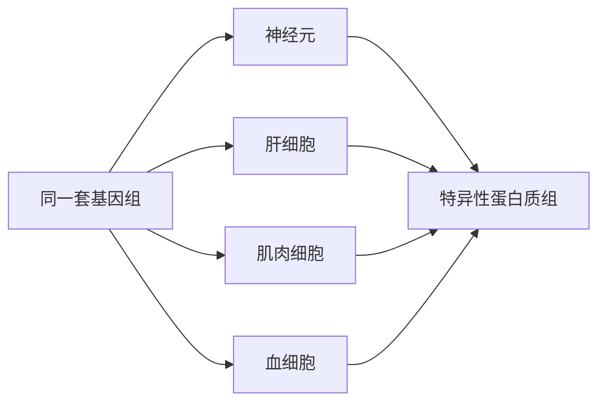
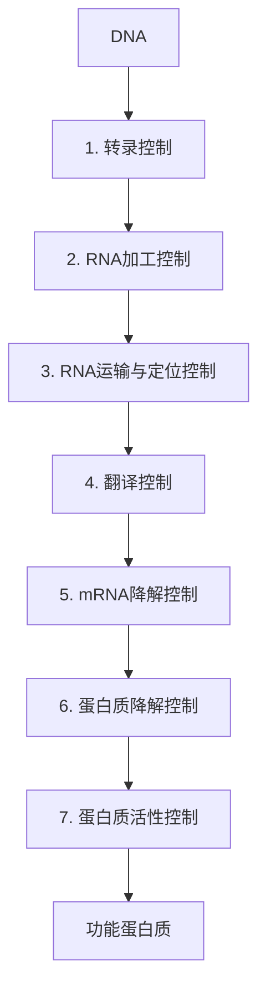
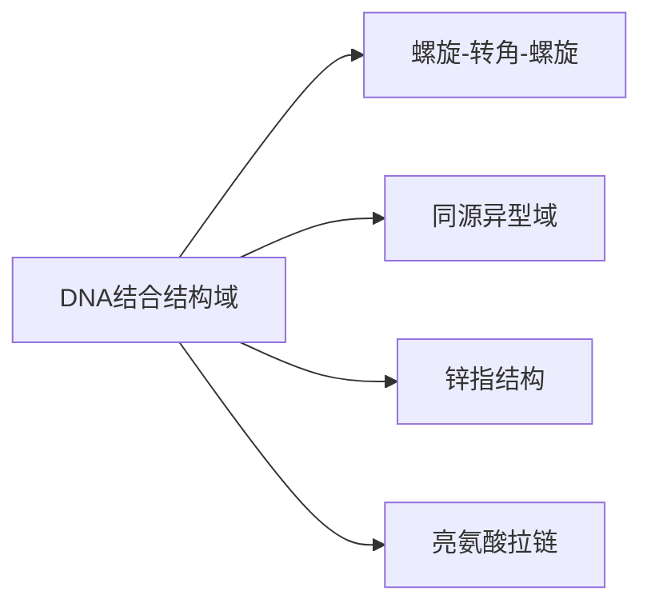
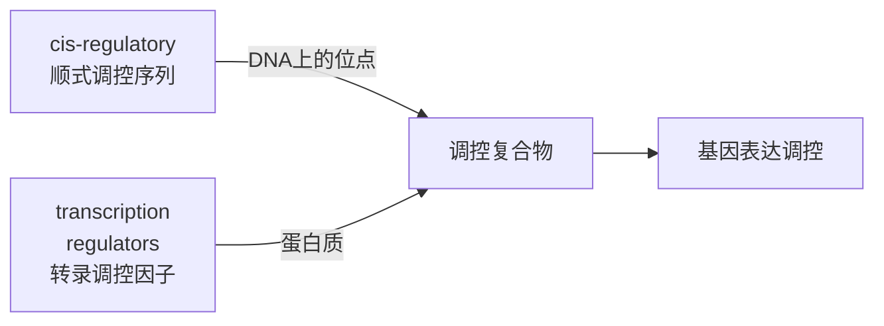
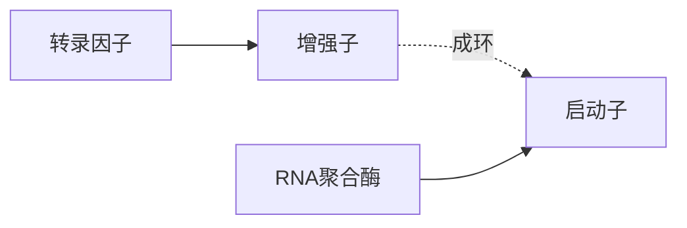
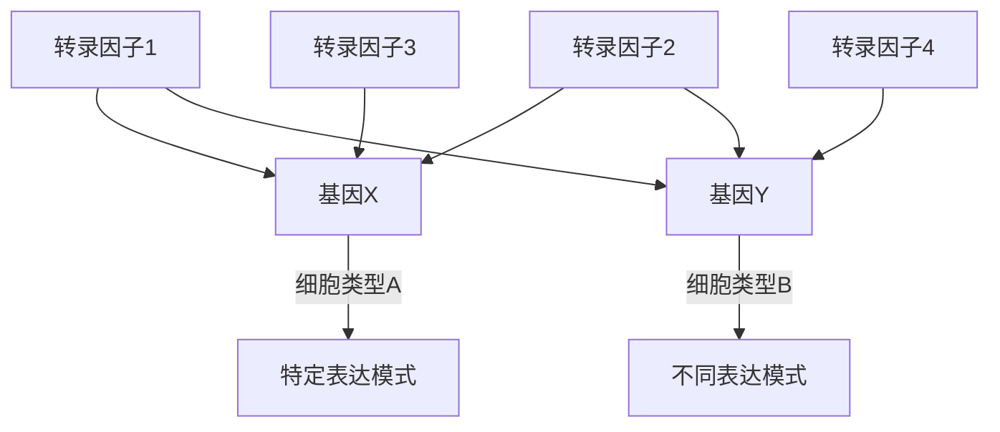
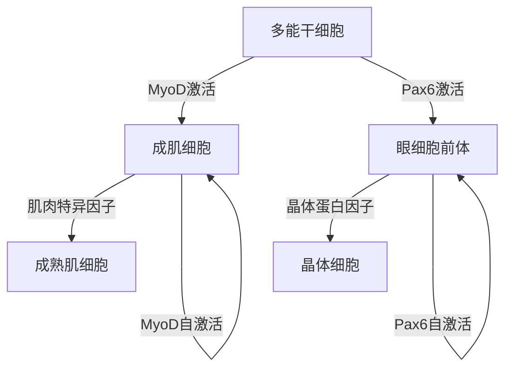
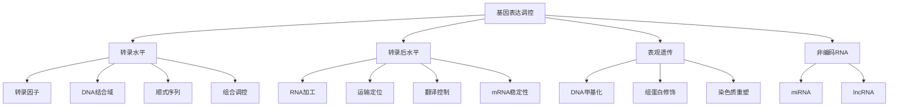

# Control of Gene Expression

## 基因表达调控的分子机制

### Chapter 7 | Molecular Biology of the Cell

<div class="pt-12">
  <span class="px-2 py-1 rounded cursor-pointer" hover="bg-white bg-opacity-10">
    按空格键进入下一页 →
  </span>
</div>

---

# 目录 | Table of Contents

## 第一部分：开场与概述

1. 基因控制概述
2. 转录水平的调控
3. 转录调控因子

## 第二部分：细胞特化

4. 细胞特化的分子机制
5. 细胞记忆的维持
6. 转录后调控
7. 非编码RNA的调控

<div class="mt-8 grid grid-cols-3 gap-4 text-sm">
  <div class="bg-blue-50 p-3 rounded-lg">
    <span class="text-blue-600 font-bold">📖 理论</span><br>多层次调控机制
  </div>
  <div class="bg-green-50 p-3 rounded-lg">
    <span class="text-green-600 font-bold">🔬 实验</span><br>核移植与克隆
  </div>
  <div class="bg-purple-50 p-3 rounded-lg">
    <span class="text-purple-600 font-bold">🧬 应用</span><br>生物竞赛考点
  </div>
</div>

---

# 学习目标 | Learning Objectives

<div class="grid grid-cols-3 gap-6 mt-8">

<div class="text-center p-4 bg-blue-50 rounded-lg">

### 🧠 理解

基因表达调控的多层次性

- 7个调控层次
- 核心调控点
- 层级整合

</div>

<div class="text-center p-4 bg-green-50 rounded-lg">

### 🔬 掌握

转录调控因子的作用机制

- DNA识别结构
- 结合特异性
- 调控开关

</div>

<div class="text-center p-4 bg-purple-50 rounded-lg">

### 💡 应用

解释细胞分化的分子基础

- 细胞特异性
- 转录因子网络
- 表观遗传记忆

</div>

</div>

---

# 核心问题 | Core Question

## 同一个基因组，如何产生不同的细胞类型？



<div class="mt-6 grid grid-cols-2 gap-4">

<div class="p-3 bg-gray-50 rounded">
  <strong>现象</strong><br>
  - 相同DNA<br>
  - 不同形态和功能
</div>

<div class="p-3 bg-gray-50 rounded">
  <strong>机制</strong><br>
  - 基因选择性表达<br>
  - 转录调控网络
</div>

</div>

---

# 基因表达调控的7个层次



<div class="mt-6 grid grid-cols-2 gap-4 text-sm">

<div class="p-3 bg-blue-50 rounded">
  <strong>细胞核内</strong><br>
  - 转录调控（核心）<br>
  - RNA加工<br>
  - 核输出
</div>

<div class="p-3 bg-green-50 rounded">
  <strong>细胞质内</strong><br>
  - 翻译调控<br>
  - mRNA稳定性<br>
  - 蛋白质降解<br>
  - 酶活性调控
</div>

</div>

---

# 细胞分化的经典证据

## 三大经典实验

<div class="grid grid-cols-3 gap-4 mt-6">

<div class="text-center p-3 bg-blue-50 rounded">

### 青蛙核移植实验

- Gurdon (1962)
- 肠细胞核 → 去核卵细胞
- **产生完整蝌蚪**

</div>

<div class="text-center p-3 bg-green-50 rounded">

### 植物细胞全能性

- 胡萝卜韧皮部细胞
- 单细胞 → 完整植株
- **证明细胞全能性**

</div>

<div class="text-center p-3 bg-purple-50 rounded">

### 哺乳动物克隆

- 多莉羊 (1997)
- 乳腺细胞核
- **体细胞克隆成功**

</div>

</div>

<div class="mt-6 p-4 bg-yellow-50 rounded text-center">
  <strong>关键结论：</strong> 已分化细胞保留完整基因组，差异在于基因表达模式
</div>

---

# RNA表达的细胞特异性

## RNA-seq数据展示 | Figure 7-3

<div class="grid grid-cols-2 gap-6 mt-6">

<div class="bg-white p-4 rounded">

### β-actin 基因

- ✅ 在所有细胞中表达
- 看家基因 (housekeeping gene)
- 细胞骨架成分
- **表达量稳定**

</div>

<div class="bg-white p-4 rounded">

### 酪氨酸氨基转移酶

- ❌ 仅在肝细胞表达
- 参与氨基酸代谢
- **组织特异性表达**
- 其他细胞沉默

</div>

</div>

<div class="mt-6">
  <div class="w-full bg-gray-200 rounded">
    <div class="bg-blue-500 h-4 rounded" style="width: 85%">β-actin (所有细胞)</div>
  </div>
  <div class="w-full bg-gray-200 rounded mt-2">
    <div class="bg-green-500 h-4 rounded" style="width: 90%">肝细胞</div>
    <div class="bg-red-500 h-4 rounded mt-1" style="width: 5%">其他细胞</div>
  </div>
</div>

---

# 蛋白质组的差异

## 人脑 vs 人肝的蛋白质组比较 | Figure 7-4

<div class="grid grid-cols-2 gap-6 mt-6">

<div>

### 2D凝胶电泳技术

- 第一维：等电点分离
- 第二维：分子量分离
- 每个点代表一个蛋白质

### 结果分析

- 🔴 **红色点**：共有蛋白（约5000个）
- 🔵 **蓝色点**：组织特异性蛋白
  - 脑特异：神经递质相关
  - 肝特异：代谢酶类

</div>

<div class="bg-gray-50 p-4 rounded">

```
人脑特异蛋白:
  - 神经丝蛋白
  - 突触素
  - 脑特异性酶

人肝特异蛋白:
  - 尿素循环酶
  - 解毒酶 (P450)
  - 葡萄糖-6-磷酸酶
```

</div>

</div>

---

# mRNA谱与细胞识别

## 单细胞RNA测序 | Figure 7-5

<div class="mt-6">

### 实验设计

- 4000个神经元
- 单细胞RNA-seq
- 聚类分析

### 结果

- 分成 **7个亚型**
- 每种亚型表达特定基因组合
- 热图展示表达模式

</div>


<div class="mt-6 text-center">
  <div class="inline-block bg-blue-100 p-2 rounded">
    <strong>关键发现：</strong> mRNA表达谱可以精确识别细胞类型
  </div>
</div>

---

# 外界信号的影响

## 糖皮质激素对基因表达的调控

<div class="grid grid-cols-2 gap-6 mt-6">

<div class="bg-white p-4 rounded">

### 信号通路

1. 激素结合受体
2. 受体进入细胞核
3. 结合调控序列
4. 调控基因表达

### 同一信号，不同响应

- **肝细胞**：诱导糖异生酶
- **肌肉细胞**：促进蛋白质分解
- **脂肪细胞**：促进脂解

</div>

<div class="bg-gray-50 p-4 rounded">

### 可逆性调控

- 激素撤除后表达恢复
- 动态调控机制

### 永久性特征

- 细胞分化
- 表观遗传记忆
- 不依赖持续信号

</div>

</div>

---

# DNA双螺旋的结构特征

## 大沟与小沟 | Figure 7-7, 7-8

<div class="grid grid-cols-2 gap-6 mt-6">

<div class="bg-blue-50 p-4 rounded">

### 大沟 (Major Groove)

- **宽度**：2.2 nm
- **深度**：可接近碱基边缘
- **信息量**：**高**
- **识别**：蛋白质主要结合位点

### 碱基特征暴露

- 氢键供体/受体
- 疏水基团
- 甲基化位点

</div>

<div class="bg-green-50 p-4 rounded">

### 小沟 (Minor Groove)

- **宽度**：1.2 nm
- **深度**：较浅
- **信息量**：低
- **识别**：辅助结合位点

### 空间限制

- 空间拥挤
- 识别能力有限

</div>

</div>

<div class="mt-6 text-center">
  <div class="inline-block bg-purple-100 p-2 rounded">
    <strong>关键点：</strong> 大沟提供更多序列识别信息，是转录因子的主要结合区域
  </div>
</div>

---

# DNA结合结构域 | Panel 7-1

## 四大类型



### 特点总结

| 类型 | 结构特征 | 代表蛋白 | 结合方式 |
|------|----------|----------|----------|
| **HTH** | 两螺旋+转角 | λ阻遏蛋白 | 识别螺旋入大沟 |
| **HD** | 三螺旋束 | 同源异型蛋白 | 第三螺旋入大沟 |
| **ZnF** | Zn²⁺配位 | GATA1, TFIIIA | α-螺旋入大沟 |
| **Zipper** | 二聚化+碱性区 | GCN4, Fos/Jun | 二聚体对称结合 |

---

# 螺旋-转角-螺旋详解

## Helix-Turn-Helix (HTH)

<div class="grid grid-cols-2 gap-6 mt-6">

<div class="bg-white p-4 rounded">

### **结构特征**

- 两个α螺旋
- 中间短肽转角（3-4个残基）
- 螺旋间距：3.4 nm

### **识别机制**

- 第二螺旋（识别螺旋）
- 插入DNA大沟
- 氨基酸侧链与碱基特异性结合
- 通常识别6-8 bp序列

</div>

<div class="bg-gray-50 p-4 rounded">

### **λ噬菌体阻遏蛋白**

- 经典HTH例子
- 识别操纵子序列
- 侧链-碱基氢键网络
- 约20个接触点

```
精氨酸-鸟嘌呤
天冬酰胺-腺嘌呤
谷氨酰胺-鸟嘌呤
```

</div>

</div>

---

# 锌指结构家族

## Zinc Finger Domains

<div class="grid grid-cols-2 gap-6 mt-6">

<div class="bg-blue-50 p-4 rounded">

### **C2H2型锌指**（最常见）

- 保守序列：Cys-X₂₋₄-Cys-X₁₂-His-X₃₋₅-His
- Zn²⁺配位：2Cys + 2His
- α-螺旋插入大沟
- 识别3 bp序列

### **多锌指串联**

- 每个锌指识别3 bp
- 多个锌指串联增强特异性
- 例如：3锌指 → 识别9 bp

</div>

<div class="bg-green-50 p-4 rounded">

### **GATA1转录因子**

- 2个锌指结构
- N端锌指：蛋白-蛋白相互作用
- C端锌指：特异性识别DNA
- 结合序列：WGATAR

### **功能意义**

- 红细胞发育关键因子
- 突变导致贫血症

</div>

</div>

---

# 亮氨酸拉链与碱性结构域

## Leucine Zipper + Basic Region

<div class="grid grid-cols-2 gap-6 mt-6">

<div class="bg-purple-50 p-4 rounded">

### **二聚化结构域**

- 亮氨酸间隔排列（每7个残基）
- 两个α螺旋形成卷曲螺旋
- 疏水相互作用
- **像拉链一样紧密结合**

### **二聚化意义**

- 增加稳定性
- 扩大接触面
- 提高结合特异性
- 可形成同源/异源二聚体

</div>

<div class="bg-yellow-50 p-4 rounded">

### **碱性结构域**

- 富含碱性氨基酸（Arg, Lys）
- 位于拉链上游
- 直接与DNA大沟结合
- 识别回文序列

### **GCN4例子**

- 酵母转录因子
- 应激反应调控
- 经典亮氨酸拉链结构
- 与DNA形成钳状结合

</div>

</div>

---

# 核小体与DNA可及性

## Chromatin Accessibility

<div class="grid grid-cols-2 gap-6 mt-6">

<div class="bg-blue-50 p-4 rounded">

### **核小体阻碍**

- 146 bp DNA缠绕组蛋白
- 大沟被组蛋白遮挡
- 转录因子无法接近
- **天然屏障**

### **调控机制**

- 染色质重塑复合物
- 组蛋白修饰
- 核小体滑动/移除
- 开放染色质区域

</div>

<div class="bg-green-50 p-4 rounded">

### **DNA可及性**

- 活跃基因：开放染色质
- 沉默基因：紧密染色质
- DNase I超敏感位点
- 核小体定位变化

### **功能意义**

- 表观遗传调控
- 细胞类型特异性
- 发育时序控制

</div>

</div>

---

# 转录调控的核心概念

## 顺式与反式调控



<div class="grid grid-cols-2 gap-6 mt-6">

<div class="bg-white p-4 rounded">

### **顺式调控序列 (cis)**

- 位于目标基因附近
- DNA上的特定位点
- 包括：
  - 启动子
  - 增强子
  - 沉默子
  - 绝缘子

</div>

<div class="bg-gray-50 p-4 rounded">

### **转录调控因子 (trans)**

- 蛋白质编码基因
- 在细胞核内扩散
- 结合顺式序列
- 约10%基因编码转录因子

### **功能**

- 激活转录
- 抑制转录
- 调控时序
- 整合信号

</div>

</div>

---

# 色氨酸阻遏蛋白

## Trp Repressor | Figure 7-10

<div class="grid grid-cols-2 gap-6 mt-6">

<div class="bg-blue-50 p-4 rounded">

### **负调控机制**

- 色氨酸作为辅阻遏物
- 高色氨酸 → 阻遏蛋白激活
- 结合操纵子 → 阻止转录
- 关闭色氨酸合成基因

### **分子机制**

- 色氨酸结合阻遏蛋白
- 构象变化
- 暴露DNA结合域
- 结合特异性序列

</div>

<div class="bg-green-50 p-4 rounded">

### **低色氨酸状态**

- 阻遏蛋白无活性
- 无法结合DNA
- RNA聚合酶可转录
- 合成色氨酸

### **生物学意义**

- 节约能量
- 避免过量合成
- 负反馈调控
- 快速响应

</div>

</div>

---

# 正调控与激活蛋白

## Positive Control vs Negative Control

<div class="grid grid-cols-2 gap-6 mt-6">

<div class="bg-purple-50 p-4 rounded">

### **激活蛋白**

- 结合增强子/启动子
- 招募共激活因子
- 促进RNA聚合酶结合
- **增强转录**

### **CAP-cAMP例子**

- 低葡萄糖 → cAMP升高
- cAMP结合CAP
- CAP-cAMP复合物结合启动子
- 激活乳糖操纵子

</div>

<div class="bg-yellow-50 p-4 rounded">

### **阻遏蛋白**

- 结合操纵子
- 阻碍聚合酶
- **抑制转录**

### **葡萄糖效应**

- 高葡萄糖 → 低cAMP
- CAP无法激活
- 即使有乳糖也不表达
- **分解代谢物阻遏**

</div>

</div>

---

# DNA成环机制

## DNA Looping

<div class="mt-6">

### **远距离调控**

- 增强子可位于启动子上游数千碱基
- 甚至位于内含子或下游
- **通过成环拉近距离**

### **协同作用**

- 多个转录因子同时结合
- DNA弯曲蛋白辅助
- 形成环状结构
- 转录机器聚集



</div>

<div class="mt-6 bg-blue-50 p-4 rounded text-center">
  <strong>关键点：</strong> DNA成环使远距离调控序列能够与启动子直接相互作用
</div>

---

# 真核生物的转录调控

## 组合调控网络



### **组合调控逻辑**

- **AND逻辑**：所有因子都需存在
- **OR逻辑**：任一因子存在即可
- **NOT逻辑**：阻遏因子抑制

### **协同效应**

- 多因子结合增强稳定性
- 招募染色质修饰酶
- 形成转录工厂
- 放大调控信号

---

# 细胞分化的分子基础

## 转录因子网络驱动分化



### **MyoD与肌肉分化**

- **主调控因子** (master regulator)
- 表达MyoD → 细胞向肌肉分化
- 激活肌肉特异基因
- 抑制其他细胞命运

### **级联调控**

- 主因子激活下游因子
- 下游因子激活特异基因
- 正反馈维持状态

---

# 表观遗传与细胞记忆

## Epigenetic Memory

<div class="grid grid-cols-3 gap-4 mt-6">

<div class="bg-blue-50 p-3 rounded text-center">

### **DNA甲基化**

- CpG岛甲基化
- 沉默基因
- 复制后维持
- 长期稳定

</div>

<div class="bg-green-50 p-3 rounded text-center">

### **组蛋白修饰**

- 乙酰化 → 激活
- 甲基化 → 激活/抑制
- 磷酸化、泛素化
- "组蛋白密码"

</div>

<div class="bg-purple-50 p-3 rounded text-center">

### **染色质重塑**

- 核小体定位
- 染色质开放性
- 可及性调控
- 细胞特异性

</div>

</div>

<div class="mt-6 bg-yellow-50 p-4 rounded text-center">
  <strong>关键功能：</strong> 表观遗传修饰在细胞分裂中稳定传递，维持细胞身份
</div>

---

# 转录后调控

## Post-transcriptional Control

<div class="grid grid-cols-4 gap-3 mt-6 text-sm">

<div class="bg-blue-50 p-2 rounded">

**RNA加工**
- 选择性剪接
- 加帽/加尾
- 编辑

</div>

<div class="bg-green-50 p-2 rounded">

**RNA运输**
- 核输出
- 细胞质定位
- 局部翻译

</div>

<div class="bg-purple-50 p-2 rounded">

**翻译调控**
- 起始因子
- miRNA抑制
- RNA结合蛋白

</div>

<div class="bg-orange-50 p-2 rounded">

**mRNA稳定性**
- 降解速率
- AU-rich元件
- P-body

</div>

</div>

### **非编码RNA的作用**

- **miRNA**：靶向降解/抑制翻译
- **lncRNA**：染色质调控、支架作用
- **circRNA**：miRNA海绵、调控功能

---

# 核心概念回顾



---

# 竞赛考点提示

## ⚠️ 重要考点

<div class="grid grid-cols-2 gap-4 mt-6">

<div class="bg-red-50 p-4 rounded">

### **高频考点**

- ✅ 4种DNA结合结构域
- ✅ 转录因子作用机制
- ✅ 7个调控层次
- ✅ 核移植实验证据

</div>

<div class="bg-yellow-50 p-4 rounded">

### **难点突破**

- 🔴 组合调控逻辑（AND/OR）
- 🔴 DNA大沟识别机制
- 🔴 表观遗传记忆维持
- 🔴 色氨酸操纵子调控

</div>

</div>

<div class="mt-6 bg-green-50 p-4 rounded">

### **易错点提醒**

- ❌ 正调控 vs 负调控混淆
- ❌ 顺式序列与反式因子概念
- ❌ 真核与原核调控区别
- ❌ 表观遗传修饰类型

</div>

---

# 结束页 | Thank You

## Control of Gene Expression

### 基因表达调控的分子机制

**Chapter 7 | Molecular Biology of the Cell**

<div class="mt-8 grid grid-cols-2 gap-4 text-sm">

<div class="bg-blue-50 p-3 rounded text-center">
  问题与讨论
</div>

<div class="bg-green-50 p-3 rounded text-center">
  参考资料：MBOC7 Chapter 7
</div>

</div>

<div class="pt-12">
  <span class="px-2 py-1 rounded cursor-pointer" hover="bg-white bg-opacity-10">
    Thank You / 谢谢！
  </span>
</div>

---
layout: center
class: text-center
---

# Q&A

<div class="abs-br m-6 flex gap-2">
  <button @click="$slidev.nav.openInEditor()" title="打开编辑器" class="text-xl icon-btn opacity-50 !border-none !hover:opacity-100">
    <carbon:edit />
  </button>
  <a href="https://github.com/slidevjs/slidev" target="_blank" alt="GitHub" class="text-xl icon-btn opacity-50 !border-none !hover:opacity-100">
    <carbon-logo-github />
  </a>
</div>
